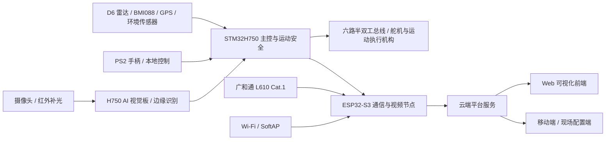

# 铁路货场空地一体智能巡检系统

## 项目信息

- 作品来源：兰州交通大学
- 指导老师：张学军
- 队长：樊文鑫
- 参赛队员：康泰铭
- 获奖信息：2025年全国大学生物联网设计竞赛广和通 AIoT 命题全国一等奖

## 项目简介

本作品面向铁路货场安全巡检与运维管理场景，构建了“铁路货场空地一体智能巡检系统”，旨在通过物联网、边缘智能、移动机器人和可视化交互技术提升货场巡检的实时性、连续性和安全保障能力。系统以地面智能巡检平台为现场执行主体，融合运动控制、视频采集、端侧识别、环境感知、定位导航、事件记录和远程管理等能力，完成货场道路、轨旁环境、人员闯入、障碍物、设备状态等巡检信息的采集、识别、展示与辅助处置。

系统采用“现场感知、边缘分析、网络传输、云端管理、远程处置”的协同架构，将底层控制、视频链路、AI 识别、定位服务、告警台账和智能建议进行集成，形成从巡检任务执行到异常事件反馈的闭环。项目重点面向铁路货场开放环境下人工巡检覆盖不连续、异常发现不及时、信息记录分散等问题，为货场日常巡检、风险预警和运维调度提供一种可扩展的智能化解决方案。

## 目录结构

```text
├── README.md
├── docs/                         # 项目文档、设计报告与通信资料
│   └── project/
├── hardware/                     # 硬件设计资料
│   ├── pcb/                      # PCB 工程文件
│   ├── mechanical/               # 结构与 3D 模型
│   └── bom.csv                   # 物料清单
├── firmware/                     # 设备底层固件源码
│   ├── h750/                     # STM32H750 主控与运动控制
│   └── esp32_l610/               # ESP32、视频与 L610 通信固件
├── edge_computing/               # 边缘计算与智能算法
│   ├── algorithm/                # 业务算法代码与说明
│   ├── ai_model/                 # 模型训练与部署文件
│   └── requirements.txt          # 环境依赖
├── cloud/                        # 云端平台服务
│   ├── iot_platform/             # 设备接入、协议服务与事件存储
│   ├── web_frontend/             # 数据可视化网页
│   └── mobile_app/               # Android / Windows 客户端预留
└── tools/                        # 构建、调试与部署脚本
```

## 核心功能

- 运动控制：支持巡检平台前进、后退、转向、停止、速度调节、自动巡检与手动巡检切换。
- 机械臂与云台协同：支持机械臂二维遥感控制、夹爪动作、基准回位和巡检过程中的姿态扫描。
- 视频采集与传输：通过现场摄像头采集巡检画面，前端控制台展示实时视频流并支持识别结果叠加。
- 边缘视觉识别：围绕人员越界、道旁异物、车门异常、轨道损坏等货场巡检场景进行目标识别与事件生成。
- 传感与状态采集：面向姿态、距离、定位和环境状态等信息进行采集，为运动控制、风险判断和任务记录提供数据基础。
- 定位与路径规划：支持 GPS/北斗定位数据接入，结合地图页面展示当前位置，并提供目的地选择与路径规划能力。
- 网络通信与自动发现：通过 Wi-Fi、局域网发现、WebSocket 和本地服务协同，降低现场部署时对固定 IP 的依赖。
- 告警记录与辅助处置：对异常事件进行告警防抖、队列展示、CSV 台账记录，并结合智能 Agent 输出处置建议。
- 可视化管理：云端网页、手机端和现场配置端面向控制、视频、定位、传感器、事件和网络状态提供统一入口。

## 系统架构



系统底层由运动主控、舵机执行机构、摄像头、定位模块和环境传感器构成，负责现场动作执行与原始数据采集。边缘侧承担视频识别、事件筛选和部分状态判断，减少对远端网络的依赖。ESP32-S3 与 L610 通信节点负责视频链路、网络接入和状态上报，云端平台统一承接设备接入、控制转发、事件存储和可视化展示。前端网页和移动端作为人机交互入口，提供控制、监测、定位、告警和配置能力。

## 仓库说明

本仓库是从项目完整交付包中整理出的 GitHub 展示与开发版本，保留代码结构、核心功能文件、固件、工具脚本和说明文档；未包含 JRE runtime、构建产物、运行日志、历史备份和重复 JAR 文件。

真实 API Key、访问令牌和本机专属配置不进入公开仓库。需要本地配置时，可参考 `.env.example` 或 `cloud/web_frontend/frontend/static/js/app-config.local.example.js`。
