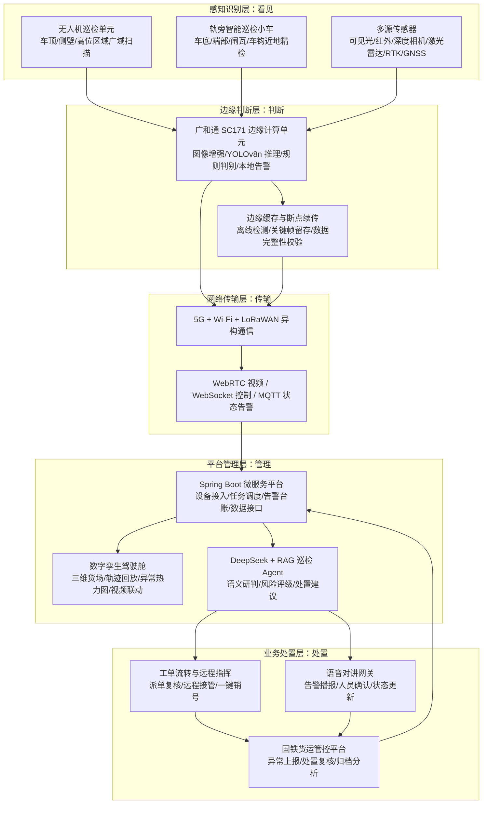

# 铁路货场空地一体智能巡检系统

## 项目信息

- 作品来源：兰州交通大学
- 团队名称：空轨智行者
- 指导老师：张学军
- 队长：樊文鑫
- 参赛队员：康泰铭
- 获奖信息：2026年全国大学生物联网设计竞赛广和通 AIoT 命题全国一等奖

## 项目简介

本作品面向现代铁路货场安全巡检与智能运维场景，构建了“铁路货场空地一体智能巡检系统”。系统以广和通 SC171 高性能边缘计算模组为核心，融合 5G/Wi-Fi/LoRaWAN 异构通信、物联网多源感知、轻量化视觉识别、数字孪生可视化与云端多模态 Agent 决策技术，形成“感知-传输-分析-决策-执行”的智慧铁路巡检闭环。

系统由空中多旋翼无人机与地面轨旁智能巡检小车协同完成巡检任务。无人机负责车顶、侧壁、高位区域的快速广域扫描，地面小车负责车底、端部、制动软管、闸瓦、车钩、施封锁等近地盲区的贴近式精检。SC171 边缘计算单元在现场完成图像增强、YOLOv8n 轻量化模型推理、异常初筛、本地告警与缓存续传；云端平台承担数据管理、数字孪生展示、DeepSeek + RAG 知识库研判、工单流转、语音对讲闭环与国铁货运管控平台对接。

项目聚焦铁路货场传统人工巡检劳动强度高、盲区多、记录分散、异常处置链条长等问题，通过“空地协同、边云协同、人机协同”的系统架构，将前端多源感知、端侧智能判断、可靠通信传输、平台集中管理和现场处置复核贯通起来，为铁路货场提供可扩展、可追溯、可闭环的智能巡检解决方案。

## 目录结构

```text
├── README.md
├── docs/                                  # 设计文档、技术报告、部署说明和定位资料
│   └── project/
├── cloud/                                 # 前后端一体化平台代码
│   ├── iot_platform/backend/              # Spring Boot 后端、接口、WebSocket 与数据服务
│   ├── web_frontend/frontend/static/      # 静态页面、视频、控制台、地图与可视化资源
│   └── mobile_app/                        # 移动端/现场终端资料预留
├── edge_computing/                        # SC171 边缘智能相关资料
│   ├── algorithm/                         # 图像增强、异常判别、路径规划和告警策略说明
│   ├── ai_model/                          # YOLOv8n/ONNX 模型与类别文件
│   └── requirements.txt
├── firmware/                              # 端侧控制与通信固件
│   └── esp32_l610/                        # ESP32 通信、运动控制、视频链路与烧录文件
├── hardware/                              # 硬件集成、结构、PCB 与物料资料
│   ├── pcb/
│   ├── mechanical/
│   ├── README.md                          # “铁途灵探”巡检平台硬件清单说明
│   └── bom.csv
└── tools/                                 # 启动、停止、调试和定位接收脚本
    └── scripts/
```

文档图 3-2 对应的前后端一体化代码结构在本仓库中整理为：

```text
cloud/iot_platform/backend/
├── src/main/java/team/vastsea/smarttilleye/
│   ├── config/                            # 跨域、WebSocket、车辆控制与信令配置
│   ├── controller/                        # 视觉检测、告警记录、决策和 Agent 接口
│   ├── dao/                               # 数据访问接口
│   ├── entity/                            # 请求、响应、告警、检测结果和表格实体
│   ├── service/                           # 视觉识别、告警、决策、Agent 和局域网发现服务
│   └── SmartTillEye.java                  # Spring Boot 启动入口
├── src/main/resources/
│   ├── config/mybatis-config.xml
│   ├── mapper/DecisionMapper.xml
│   ├── templates/webrtc.html
│   ├── application.yaml
│   └── banner.txt
└── src/test/java/                         # 后端测试入口

cloud/web_frontend/frontend/static/
├── css/                                   # app、bootstrap、地图与页面样式
├── img/                                   # 可视化界面图片资源
├── js/                                    # 控制、视频、检测、地图、WebSocket 与 Agent 脚本
├── cat.html
├── index.html
├── location.html
└── webrtc.html
```

## 核心功能

- 空地协同巡检：无人机进行高空广域粗检，轨旁小车进行近地精细复核，覆盖车顶、侧壁、端部、车底等关键区域。
- 多源自适应感知：融合可见光、RTK/GNSS、温湿度与设备状态等数据，适应昼间、夜间、雨雪和复杂遮挡场景。
- SC171 边缘智能推理：基于广和通 SC171 模组部署轻量化 YOLOv8n 模型，完成图像增强、关键帧筛选、异常检测、本地告警和断网缓存。
- 异常语义判别：在目标检测结果基础上叠加空间关系分析、时序一致性校验和风险等级输出，将检测框转化为可处置的铁路巡检异常。
- 可靠通信传输：采用 5G/Wi-Fi/LoRaWAN 异构通信，视频流通过 WebRTC 低延迟传输，控制指令通过 WebSocket 下发，状态与告警数据支持 MQTT/HTTP 上报和断点续传。
- 数字孪生管控：基于 WebGL/Three.js 构建货场三维数字孪生驾驶舱，展示设备位姿、巡检轨迹、异常标注、热力分布、视频画面和历史回放。
- 多模态 Agent 决策：结合 DeepSeek 大模型与 RAG 知识库，对异常事件进行语义理解、风险评级、处置建议生成和多轮问答辅助。
- 语音对讲闭环：通过对讲网关将研判结果转化为现场语音指令，支持人员确认、工单状态更新和处置销号。
- 平台对接与数据闭环：通过 RESTful API/OpenAPI 对接铁路既有货运管控平台，实现异常上报、任务派发、处置复核、台账归档和统计分析。

## 系统架构



系统整体采用“感知识别层-边缘判断层-网络传输层-平台管理层-业务处置层”的五层闭环。前端由无人机和轨旁小车完成空地双模采集，SC171 在边缘端承担实时推理、本地告警和缓存续传，网络层通过 5G、Wi-Fi 与 LoRaWAN 保障视频、控制、状态和告警数据可靠传输。平台层统一完成数据管理、数字孪生展示与大模型研判，业务处置层将异常事件转化为工单、语音指令和平台归档，最终形成“发现-判断-传输-研判-处置-复核”的全链路闭环。

## 仓库说明

本仓库是从项目完整交付包中整理出的 GitHub 展示与开发版本，保留代码结构、核心功能文件、模型文件、固件、工具脚本和说明文档；未包含运行日志、历史备份、重复构建产物和本机专属配置。

真实 API Key、访问令牌和本机专属配置不进入公开仓库。需要本地配置时，可参考 `.env.example` 或 `cloud/web_frontend/frontend/static/js/app-config.local.example.js`。
